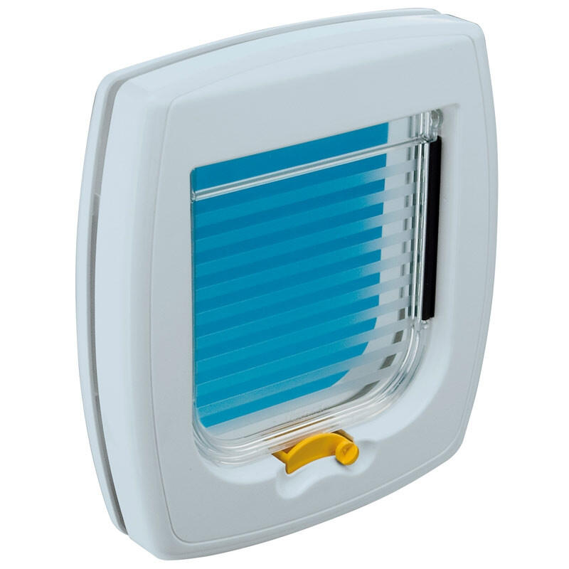
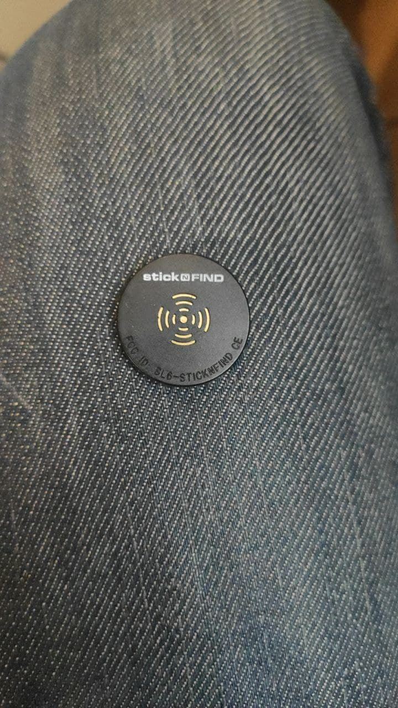
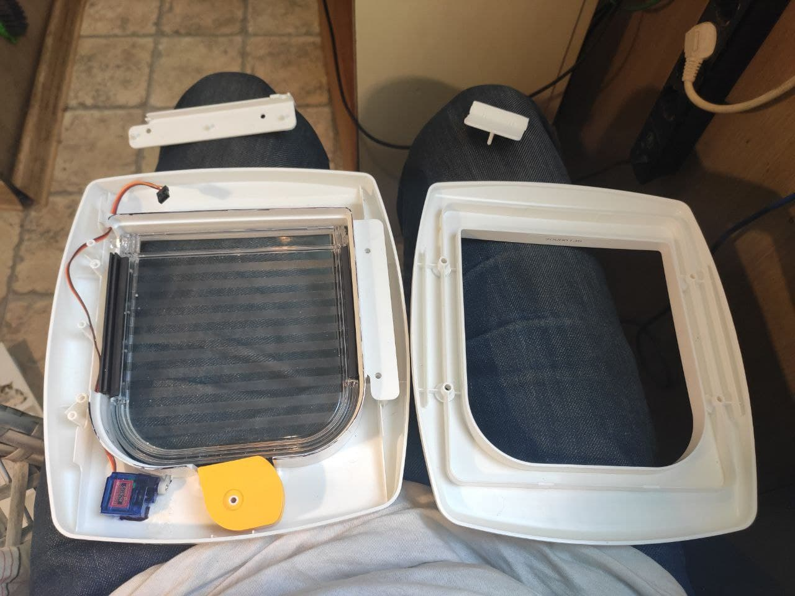
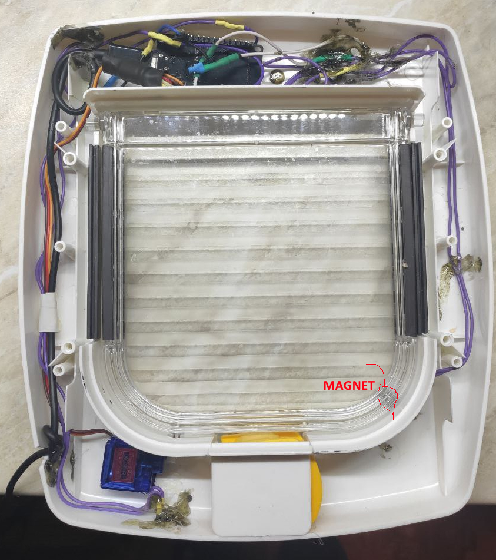
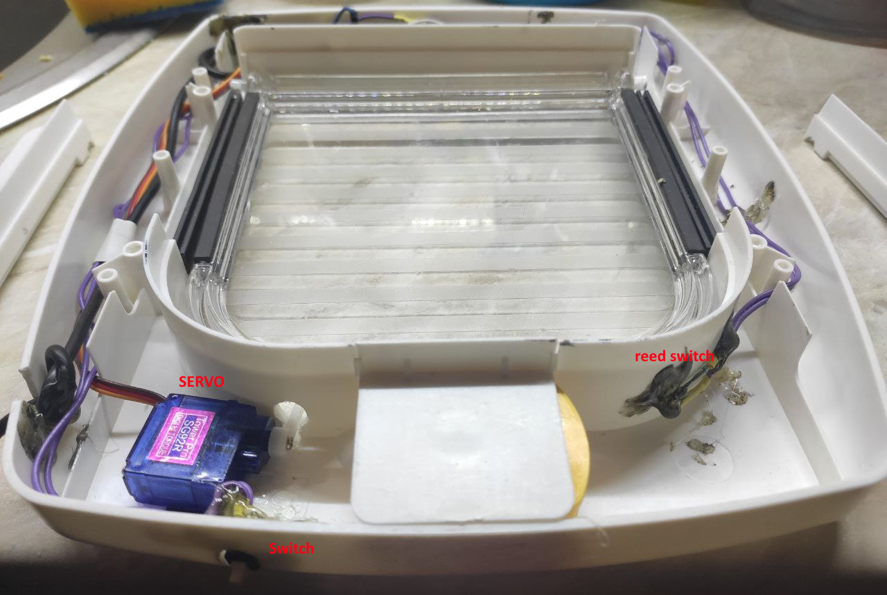
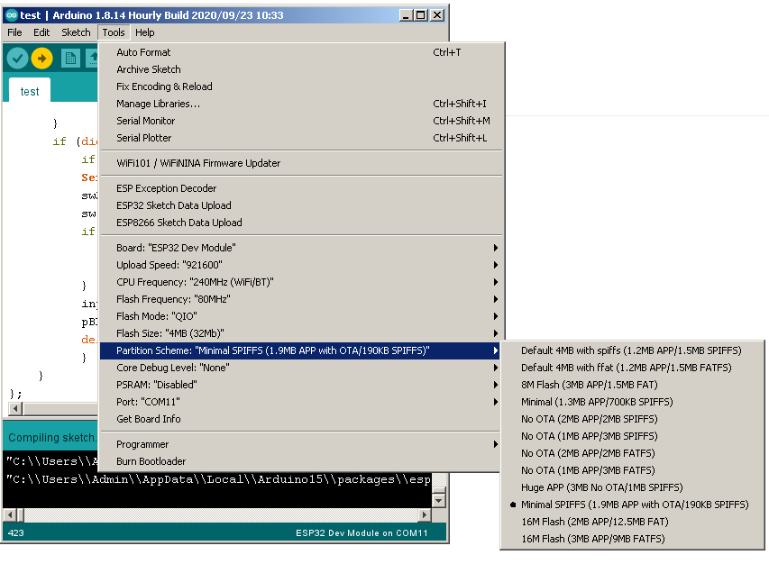
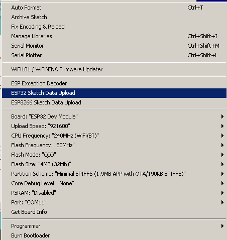
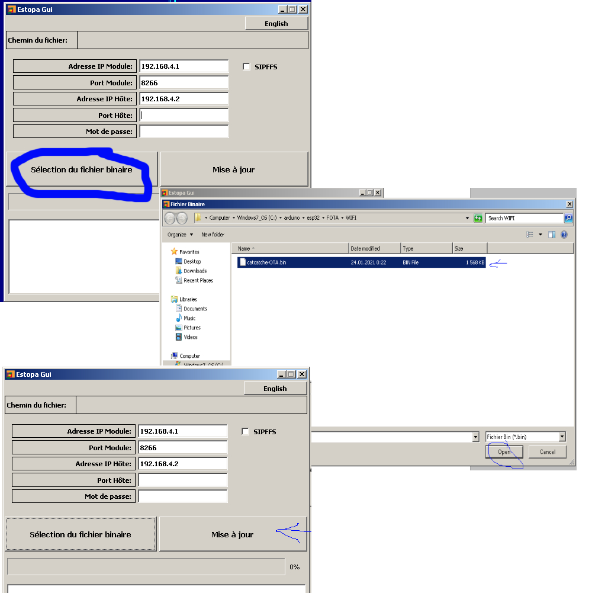

# Smart Pet Gateway 
## Based on esp32 (wroom) ble, servo and ibeacon.

>1 x Pet Door: ferplast swing 1
1 x ESP32 (I used esp32 - wroom)
2 x ble ibeacon (stick'n'found)
1 x reed switch - to determinate if the door normally closed
1 x switch (always open door connected)
1 x magnet - put it on the door,where you put reed switch(gerkon)
1 x servo motor (I used: SG92R)

## Hardware
- Servo motor connected to VCC GND, D13
- Reed switch (gerkon) connected to GND, D14
- Switch to always open door - connected to GND, D27

## Firmwaring:
- "catdoormotor_ota.ino" is arduino code. 
- Change or add mac addresses of ibeacon to arduino code.
#
-  Set parameters in arduino IDE : Tools->partition scheme ->Minimal SPIFFS
- Compile and upload it to esp32.
- After uploading firmware, create empty SPIFFS: Tools ->ESP32 Scetch Data Upload

## Working with web:
- SSID:door 
- password:doordoor
- config web: http://192.168.4.1 , here you can set RSSI power to open\close

## Update OTA
- To update firmware with ota, go to SSID:door ->  http://192.168.4.1 -> 
- Set mark to (Reboot to update firmware Device will reboot after 3 seconds, back to normal mode,reboot device again: ) 
and press submit and ok..
- It reboots to OTA.
## Prepair update over OTA
- Prepair compiled firmware with arduino ide(Set File-preferences-Settings-Show verbose output during (set both))
compile firmware...and you get path like:

>C:\Users\Admin\AppData\Local\Temp\arduino_build_41297/sketch_apr20a.ino.bin 0x8000


```You need only C:\Users\Admin\AppData\Local\Temp\arduino_build_41297/sketch_apr20a.ino.bin```

``` - Start EspotaGui.exe : set remote host 192.168.4.1, port 8266, local host 192.168.4.2 ```
```- Choose firmware and upload.. after uploading - it reboots itself```

> ``` Or you can you arduino IDE to set port for update -> 192.168.4.1  ```
>``` when OTA it must appears```
>











